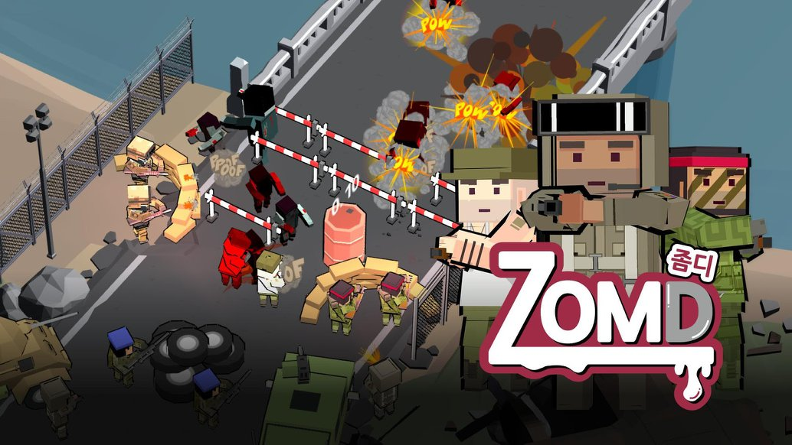
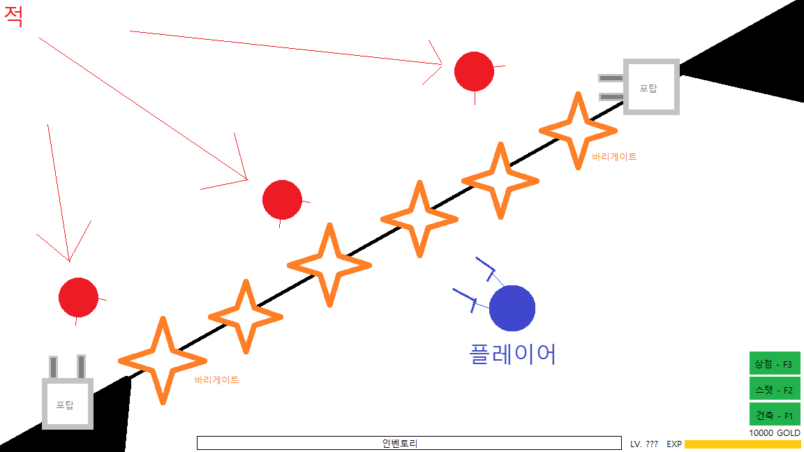
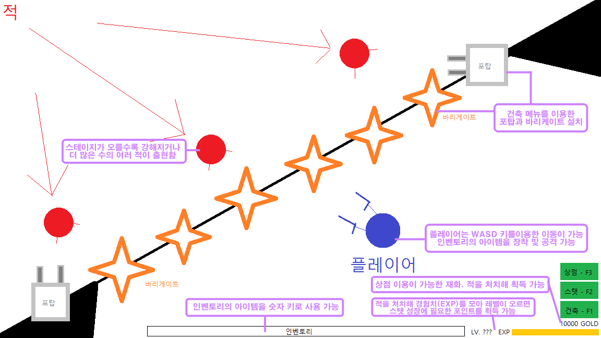
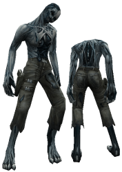
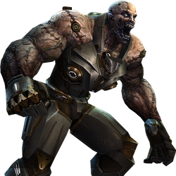
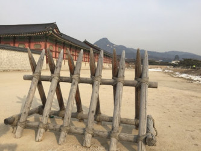
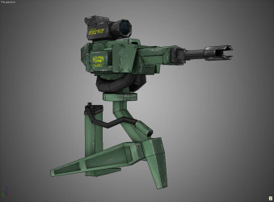
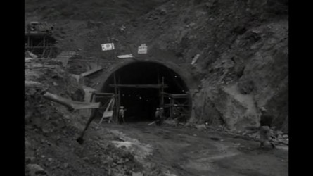
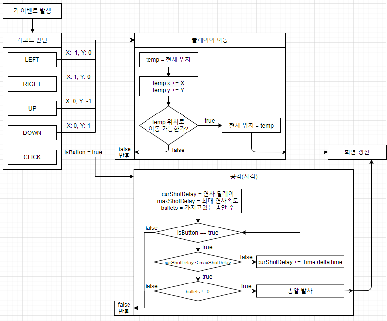

# [목차]
[1. 컨셉](#컨셉)  
[2. 관련 이미지](#관련-이미지)  
[3. 대표 이미지](#대표-이미지)  
[4. 컨셉 및 대표 이미지 기반 작품묘사](#컨셉-및-대표-이미지-기반-작품묘사)  
[5. 멸망한 세계의 생존자 구성 요소](#멸망한-세계의-생존자-구성-요소)  
[6. 게임 시스템 디자인](#게임-시스템-디자인)  
[7. 개발 요구사항 및 흐름도](#개발-요구사항-및-흐름도)  
[8. 개발작업 일정](#개발작업-일정)

  

# [컨셉]
## 메인컨셉 : 생존
- 적에게서 생존한다.
### 서브컨셉1 : 쿼터뷰
- 쿼터뷰 시점을 통해 공간감을 극대화한다.
### 서브컨셉2 : 디펜스
- 하나의 장소에서 디펜스 형식으로 몰려오는 적들을 상대한다.
### 서브컨셉3 : 건축
- 바리게이트와 터렛을 설치해 생존에 용이하도록 돕는다.

  

# [관련 이미지]

  

# [대표 이미지]

  

# [컨셉 및 대표 이미지 기반 작품묘사]
> ### 대표이미지 기반 :

  

# [몬스터 디펜스 구성 요소]
## 1. 메커니즘
[도전 과제]
1) 밀려오는 적들을 처치하고 생존하라
2) 생존을 위한 쉘터를 구성하라

[재미 요소]
1) 적을 처치해 경험치를 모아 캐릭터를 성장시킨다.
2) 텅 빈 쉘터에 방어에 도움이 되는 건축물을 설치한다.
3) 스테이지가 올라갈수록 강해지거나 더 많은 수의 여러 적이 출현한다.

 

## 2. 이야기
[카메라 관점]  
쿼터뷰
	
 

## 3. 기술  
ㅇ

  

# [게임 시스템 디자인]
## 1. 게임 오브젝트 분해

|**연번**|**오브젝트 이름**|**오브젝트 이미지**|
|:---:|:---:|:---:|
|1|생존자||
|2|일반 좀비||  
|3|보스 좀비||  
|4|바리게이트||  
|5|터렛||  
|6|총||  
|7|맵||  

 

## 2. 파라미터

- 오브젝트 이름 : 생존자

|**속성**|**속성값**|**설명**|**비고**|
|:---:|:---:|:---:|:---:|
|이름|생존자|플레이어 캐릭터||
|EXP|레벨 상승 조건|적을 처치해 획득||
|레벨|스탯 포인트 1|스탯 포인트의 획득처||
|스탯|연사 속도 등|플레이어의 능력치 상승||
|GOLD|재화|상점과 건축 이용 가능||
|인벤토리|아이템 보관 및 사용|상점 등에서 획득한 아이템의 보관 및 사용||

- 오브젝트 이름 : 일반 좀비

|**속성**|**속성값**|**설명**|**비고**|
|:---:|:---:|:---:|:---:|
|체력|낮음|체력이 0이 되면 사망||
|공격력|낮음|*||
|공격속도|보통|*||
|이동속도|보통|*||

- 오브젝트 이름 : 보스 좀비

|**속성**|**속성값**|**설명**|**비고**|
|:---:|:---:|:---:|:---:|
|체력|높음|체력이 0이 되면 사망||
|공격력|보통|*||
|공격속도|느림|*||
|이동속도|느림|*||
|특수 능력|폭주|공격 속도와 이동 속도가 빨라짐||

- 오브젝트 이름 : 바리게이트

|**속성**|**속성값**|**설명**|**비고**|
|:---:|:---:|:---:|:---:|
|내구도|*|내구도가 0이 되면 파괴됨||

- 오브젝트 이름 : 터렛

|**속성**|**속성값**|**설명**|**비고**|
|:---:|:---:|:---:|:---:|
|내구도|*|내구도가 0이 되면 파괴됨||
|공격력|*|별도의 공격력을 가짐||

- 오브젝트 이름 : 총

|**속성**|**속성값**|**설명**|**비고**|
|:---:|:---:|:---:|:---:|
|공격력|*|총기마다 각기 다른 공격력||
|연사 속도|*|총기마다 각기 다른 연사 속도||
|탄창|*|총기마다 각기 다른 탄창||

- 오브젝트 이름 : 맵

|**속성**|**속성값**|**설명**|**비고**|
|:---:|:---:|:---:|:---:|
|통로|일자 통로|적이 한 방향으로 모이는 구조||

 

## 3. 행동

- 오브젝트 이름 : 생존자

|**행동**|**설명**|
|:---:|:---:|
|이동|WASD 키를 이용한 플레이어 캐릭터의 이동|
|공격|좌클릭을 이용한 총기를 이용한 사격|
|건축|GOLD를 이용한 건축물 설치|
|스탯|플레이어의 능력치 상승|
|상점|재화를 이용한 아이템을 구매|

- 오브젝트 이름 : 일반 좀비

|**행동**|**설명**|
|:---:|:---:|
|공격|건축물 및 생존자 공격|

- 오브젝트 이름 : 보스 좀비

|**행동**|**설명**|
|:---:|:---:|
|공격|건축물 및 생존자 공격|
|폭주||

- 오브젝트 이름 : 바리게이트

|**행동**|**설명**|
|:---:|:---:|
|적 차단|적의 접근 차단|

- 오브젝트 이름 : 터렛

|**행동**|**설명**|
|:---:|:---:|
|적 공격|가까운 적을 자동 공격|

 

## 4. 상태

- 오브젝트 이름 : 생존자

|**현상태**|**전이상태**|**전이조건**|
|:---:|:---:|:---:|
|대기|이동|이동(WASD) 키 조작시|
|이동|대기|이동중 조작을 멈출시|
|대기|공격|좌클릭 조작시|
|공격|대기|공격중 조작을 멈출시|
|생존|사망|적이 생존자에게 도달시|
|사망|생존|재시작|

- 오브젝트 이름 : 일반 좀비

|**현상태**|**전이상태**|**전이조건**|
|:---:|:---:|:---:|
|이동|공격|근처에 건축물 또는 생존자가 있을시|
|공격|이동|근처에 건축물 또는 생존자가 없을시|
|사망|생존|체력이 0이 되었을시|

- 오브젝트 이름 : 보스 좀비

|**현상태**|**전이상태**|**전이조건**|
|:---:|:---:|:---:|
|이동|공격|근처에 건축물 또는 생존자가 있을시|
|공격|이동|근처에 건축물 또는 생존자가 없을시|
|일반 상태|폭주 상태|체력이 절반 밑으로 내려갈시 발동|
|사망|생존|체력이 0이 되었을시|

- 오브젝트 이름 : 바리게이트

|**현상태**|**전이상태**|**전이조건**|
|:---:|:---:|:---:|
|설치상태|파괴|내구도가 모두 닳을시|

- 오브젝트 이름 : 

|**현상태**|**전이상태**|**전이조건**|
|:---:|:---:|:---:|
|대기|공격|사정거리 내로 적이 접근시|
|공격|대기|사정거리 내에 적이 없을시|

 

## 5. 플레이어 캐릭터 속성

|**속성**|**속성값**|**설명**|**비고**|
|:---:|:---:|:---:|:---:|
|이름|생존자|플레이어 캐릭터||
|EXP|레벨 상승 조건|적을 처치해 획득||
|레벨|스탯 포인트 1|스탯 포인트의 획득처||
|스탯|연사 속도 등|플레이어의 능력치 상승||
|GOLD|재화|상점과 건축 이용 가능||
|인벤토리|아이템 보관 및 사용|상점 등에서 획득한 아이템의 보관 및 사용||

 

## 6. 게임의 규칙
- 몰려오는 적을 막아 생존한다.

 

## 7. 게임에서 사용될 공식
- 공격자의 공격력과 공격대상 체력(혹은 내구도)를 계산한다.
- 총기마다의 탄창의 개수를 지정한다.
- 건축물의 설치 공간이 적절한지 계산한다.

  

# [개발 요구사항 및 흐름도]
## 요구사항
- 게임화면은 화면 전체를 사용하며 상단과 하단에 UI가 표시된다.
- 게임화면 상단에는 스테이지 정보가 표시된다.
- 게임화면 하단에는 인벤토리, 레벨 및 경험치, GOLD, 상점, 스탯, 건축 창이 표시된다.
- 적은 상단에서 출현한다.
- 적은 체력, 공격력, 공격속도, 이동속도, 특수능력을 가진다.
- 스테이지가 오를수록 적의 수는 많아지거나 강해지며, 스테이지 마지막엔 보스가 등장한다.
- 하단에서 플레이어가 방어한다.
- 적은 플레이어를 향해 다가온다.
- 플레이어가 적에게 죽으면 패배한다.
- 적을 처치하면 GOLD를 얻을 수 있다.
- 플레이어는 키보드 조작(WASD)을 통해 이동이 가능하며, 마우스 좌클릭으로 공격이 가능하다.
- 플레이어는 키보드 조작(1~0)을 통해 인벤토리 활용이 가능하다.
- 플레이어는 키보드 조작(F1)을 통해 건축 기능을 이용 가능하다.
- 플레이어는 키보드 조작(F2)을 통해 스탯 기능을 이용 가능하다.
- 플레이어는 키보드 조작(F3)을 통해 상점 기능을 이용 가능하다.
- 건축 기능의 이용에는 GOLD가 소모된다.
-  기능의 이용에는 GOLD가 소모된다.
- 스탯 기능의 이용에는 스탯 포인트가 소모된다.
- 스탯 포인트는 레벨업당 1Point 획득할 수 있다.
- 스탯 포인트로는 연사속도 등의 플레이어 능력치를 상승시킬 수 있다.
- 적을 처치시 경험치를 획득하여 레벨을 올릴 수 있다.
- 플레이어는 건축 기능을 이용해 건축물(바리게이트)을 설치할 수 있다.
- 플레이어는 건축 기능을 이용해 건축물(터렛)을 설치할 수 있다.
- 바리게이트는 적의 접근을 막는다.
- 터렛은 가까운 적을 자동공격한다.
- 적은 가까이에 있는 오브젝트를 최우선 공격한다.
- 건축물은 내구도를 가지며 내구도가 모두 닳으면 파괴된다.
- 상점에서는 총기, 탄창 등의 아이템을 구매 가능하다.
- 구매한 아이템중 일부(총기 등)는 인벤토리에 저장되며 구매 즉시 적용되는 아이템(탄창 등)은 저장되지 않는다.
- 총기는 종류별로 서로 다른 공격력, 연사 속도, 탄창을 가진다.

 

## 요구사항(6주)
- 게임화면은 화면 전체를 사용하며 상단과 하단에 UI가 표시된다.
- 게임화면 상단에는 스테이지 정보가 표시된다.
- 게임화면 하단에는 인벤토리, 레벨 및 경험치, GOLD, 스탯 창이 표시된다.
  
- 적은 상단에서 출현한다.
- 적은 체력, 공격력, 공격속도, 이동속도, 특수능력을 가진다.
- 하단에서 플레이어가 방어한다.
- 플레이어는 키보드 조작(WASD)을 통해 이동이 가능하며, 마우스 좌클릭으로 공격이 가능하다.
  
- 적은 플레이어를 향해 다가온다.
- 플레이어가 적에게 죽으면 패배한다.

- 적을 처치하면 GOLD를 얻을 수 있다.
- 플레이어는 스탯 기능을 이용 가능하다.
- 스탯 기능의 이용에는 GOLD가 소모된다.
- 스탯 창에서 연사속도 등의 플레이어 능력치를 상승시킬 수 있다.
- 게임의 종료 조건은 모든 스테이지 클리어이다.
- 스테이지가 오를수록 적의 수는 많아지거나 강해지며, 스테이지 마지막엔 보스가 등장한다.

 

## 키보드 및 마우스 이벤트에 대한 흐름도

 

## 용어정리  

|**No**|**화면**|**용어**|**설명**|  
|:---|:---|:---|:---|:---|  
|1|시작 화면|화면 요소|시작하기 버튼|클릭 시 게임화면으로 이동한다.|  
|2|게임 화면|화면 요소|EXP|레벨 상승에 필요한 수치를 나타낸다.|  
|3|게임 화면|화면 요소|레벨|현재 레벨을 보여준다.|  
|4|게임 화면|화면 요소|GOLD|현재 소지 GOLD를 보여준다.|  
|5|게임 화면|화면 요소|인벤토리|현재 소지한 item을 보여준다.|  
|6|게임 화면|화면 요소|상점|상점창을 열 수 있는 버튼|  
|7|게임 화면|화면 요소|스탯|스탯창을 열 수 있는 버튼|  
|8|게임 화면|화면 요소|건축|건축창을 열 수 있는 버튼|  
|9|게임 화면|화면 요소|건축물|설치한 건축물|  
|10|게임 화면|화면 요소|적|플레이어를 공격하는 적|   
|11|스크립트 요소|MouseClick|마우스 좌클릭을 통해 공격(사격)한다.|  
|12|스크립트 요소|이동|키패드 입력(WASD)을 통해 이동한다.|  

  

# 개발작업 일정
[1주차](files/.md) : 카메라 뷰, UI 구현  
2주차 :   
3주차 :  
4주차 : 플레이어, 적, 터렛, 스탯 구현  
5주차 : 공격 알고리즘 및 전투 구현
6주차 : 스탯 기능 구현 및 마무리  
