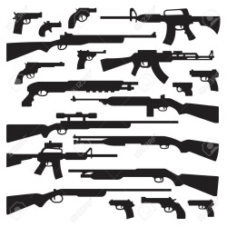

# 컨셉
## 메인컨셉 : 생존
- 적에게서 생존한다.
### 서브컨셉1 : 쿼터뷰
- 쿼터뷰 시점을 통해 공간감을 극대화한다.
### 서브컨셉2 : 디펜스
- 하나의 장소에서 디펜스 형식으로 몰려오는 적들을 상대한다.
### 서브컨셉3 : 건축
- 방벽이나 터렛을 설치해 생존에 용이하도록 돕는다.

  
# [관련 이미지 & 동영상]
- 이미지  

- 동영상

  
# [대표 이미지]

  
# [컨셉 & 대표이미지 기반 작품묘사]
> ### 대표이미지 기반 :

  

# [<멸망한 세계의 생존자> 구성 요소]
## 1. 메커니즘
[도전 과제]
1) 밀려오는 적들을 처치하고 생존하라
2) 생존을 위한 쉘터를 구성하라

[재미 요소]
1) 적을 처치해 경험치를 모아 캐릭터를 성장시킨다.
2) 텅 빈 쉘터에 방어에 도움이 되는 건축물을 설치한다.
3) 스테이지가 올라갈수록 강해지거나 더 많은 수의 여러 적이 출현한다.

 

## 2. 이야기
[카메라 관점]  
쿼터뷰
	
 

## 3. 기술  
ㅇ

  

# 게임 시스템 디자인
## 1. 게임 오브젝트 분해  
|**연번**|**오브젝트 이름**|**오브젝트 이미지**|  
|:---:|:---:|:---|
|1|생존자||
|2|일반 좀비||  
|3|보스 좀비||  
|4|바리게이트||  
|5|포탑||  
|6|총||  
|7|맵||  
